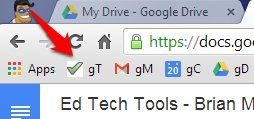

# Ed Tech Tools
### _Brian Mueller_
bmueller@hstat.org

## Table of Contents
1. [Google Tasks](#gTasks)
2. Smartboard lesson plan template

---

# Google Tasks
## Why I like it
 * It's incredible simple to use, but it's also extremely powerful and versatile.

## How to use it (beginning)
 * Make sure you're signed into Google
 * http://mail.google.com/tasks
   * 
 * I find it helpful to bookmark Tasks, Mail, Calendar, and Drive (all wonderful Google services)
 * Starts adding tasks to your list!
 * When you're done, click the check-box
 * Click "Clear completed" to clean up your list

## How to use it (mastering)
 * Keyboard shortcuts _(click "Show tips" in the top-right corner)_
   * **Move task up**: Ctrl ↑ (or Cmd ↑ on a Mac)
   * **Move task down**: Ctrl ↓ (or Cmd ↓ on a Mac)
   * **Indenting**: Tab
     * **Unindenting**: Shift+Tab
   * **_Note_**: moving tasks will also move the indented sub-tasks below it (this is helpful when you just want to move around a bunch of tasks at once)
   * Edit details: Shift+Enter
     * Or click the arrows (see the green text in the screenshot below)